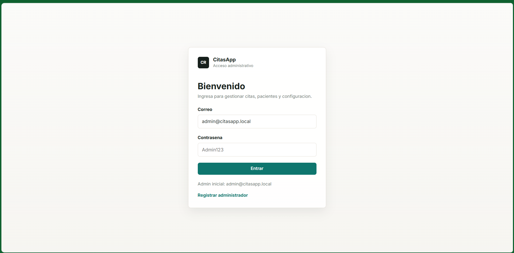
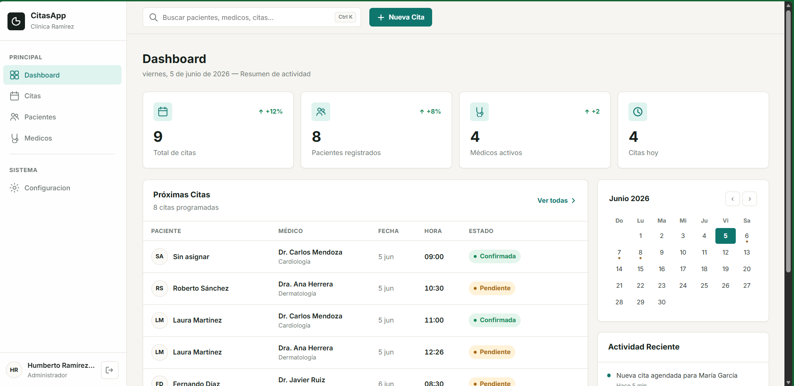
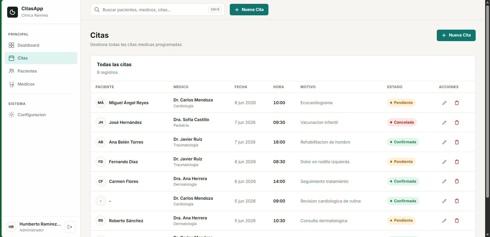
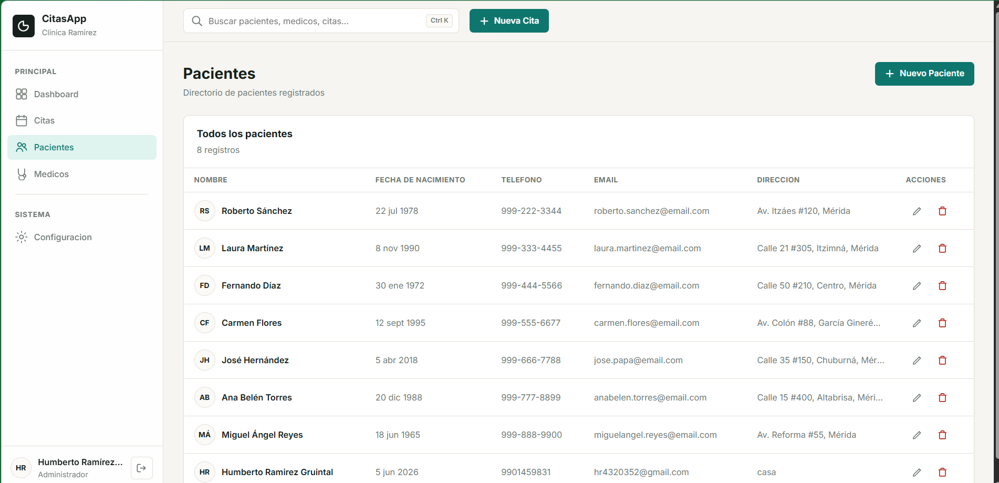
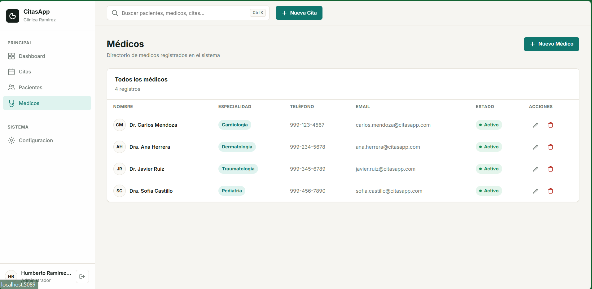
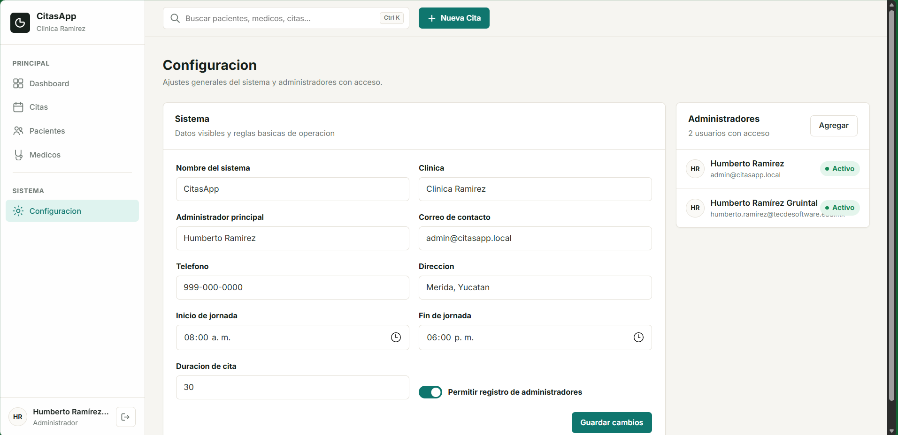

# 🏥 CitasApp

**Sistema de Gestión de Citas Médicas** desarrollado con ASP.NET Core MVC (.NET 10).

Interfaz profesional inspirada en productos SaaS como Linear, Stripe y Notion, diseñada para ofrecer una experiencia limpia, rápida y centrada en el usuario dentro del sector salud.

---


## 📸 Capturas de Pantalla

### Inicio de Sesión


### Dashboard Principal


### Gestión de Citas


### Directorio de Pacientes


### Directorio de Médicos


### Configuración del Sistema


---


## ✨ Características

- **Autenticación** con login de administrador, registro de usuarios y gestión de sesiones.
- **Dashboard** con tarjetas de estadísticas en tiempo real, próximas citas, calendario compacto y actividad reciente.
- **CRUD completo** de Citas, Médicos y Pacientes.
- **Configuración del sistema** — nombre de clínica, administrador, jornada laboral, duración de cita y gestión de usuarios.
- **Persistencia en JSON** — sin necesidad de base de datos externa.
- **Design system premium** — tipografía DM Sans, paleta cuidada, espaciado en sistema de 8px, micro-animaciones de 150ms–250ms.
- **Sidebar con navegación** y estados activos.
- **Header** con buscador (atajo Ctrl+K), botón de nueva cita y notificaciones.
- **Badges de estado** para citas: Confirmada, Pendiente, Cancelada, Completada.
- **Tablas modernas** con avatares de iniciales, hover discreto y acciones contextuales.
- **Formularios estilo Stripe** con focus ring y validación.
- **Toast notifications** para confirmaciones.
- **Diseño responsive** — desktop first, adaptable a tablet y móvil con sidebar colapsable.

---

## 🛠️ Tecnologías

| Tecnología | Uso |
|---|---|
| ASP.NET Core MVC | Framework web |
| C# | Lenguaje backend |
| .NET 10 | Runtime |
| Razor Views | Motor de vistas |
| JSON | Persistencia de datos |
| HTML5 / CSS3 | Estructura y estilos |
| JavaScript | Interacciones del lado del cliente |
| DM Sans | Tipografía principal |

---

## 📁 Estructura del Proyecto

```
CitasApp/
├── Controllers/
│   ├── AuthController.cs
│   ├── CitaController.cs
│   ├── ConfiguracionController.cs
│   ├── HomeController.cs
│   ├── MedicoController.cs
│   └── PacienteController.cs
├── Data/
│   ├── Admins.json
│   ├── Citas.json
│   ├── Medicos.json
│   ├── Pacientes.json
│   ├── Settings.json
│   ├── DateTimeConverters.cs
│   └── JsonData.cs
├── Models/
│   ├── AdminUser.cs
│   ├── AuthViewModels.cs
│   ├── Cita.cs
│   ├── CitaViewModel.cs
│   ├── DashboardViewModel.cs
│   ├── ErrorViewModel.cs
│   ├── Medico.cs
│   ├── Paciente.cs
│   └── SystemSettings.cs
├── Views/
│   ├── Auth/
│   │   ├── Login.cshtml
│   │   └── Register.cshtml
│   ├── Cita/
│   │   ├── Index.cshtml
│   │   ├── Create.cshtml
│   │   └── Edit.cshtml
│   ├── Configuracion/
│   │   └── Index.cshtml
│   ├── Home/
│   │   ├── Index.cshtml
│   │   └── Privacy.cshtml
│   ├── Medico/
│   │   ├── Index.cshtml
│   │   ├── Create.cshtml
│   │   └── Edit.cshtml
│   ├── Paciente/
│   │   ├── Index.cshtml
│   │   ├── Create.cshtml
│   │   └── Edit.cshtml
│   ├── Shared/
│   │   ├── _Layout.cshtml
│   │   ├── _Layout.cshtml.css
│   │   ├── _ValidationScriptsPartial.cshtml
│   │   └── Error.cshtml
│   ├── _ViewImports.cshtml
│   ├── _ViewStart.cshtml
│   └── Index.cshtml
├── Properties/
│   └── launchSettings.json
├── wwwroot/
│   ├── css/
│   │   └── site.css
│   ├── js/
│   │   └── site.js
│   ├── lib/
│   │   ├── bootstrap/
│   │   ├── jquery/
│   │   ├── jquery-validation/
│   │   └── jquery-validation-unobtrusive/
│   └── favicon.ico
├── appsettings.json
├── appsettings.Development.json
├── CitasApp.csproj
├── CitasApp.slnx
└── Program.cs
```

---

## 🚀 Instalación y Ejecución

### Prerrequisitos

- [.NET SDK 10.0](https://dotnet.microsoft.com/download) o superior
- Visual Studio 2022+ o VS Code

### Pasos

```bash
# 1. Clonar el repositorio
git clone https://github.com/hum55/ArqSoft-CITAPP-HumbertoRamirez.git

# 2. Entrar al proyecto
cd ArqSoft-CITAPP-HumbertoRamirez

# 3. Restaurar dependencias
dotnet restore

# 4. Ejecutar
dotnet run
```

La aplicación se abrirá automáticamente en `http://localhost:5089`.

### Credenciales de acceso

| Campo | Valor |
|---|---|
| Correo | `admin@citasapp.local` |
| Contraseña | `Admin123` |

---

## 🎨 Sistema de Diseño

### Paleta de colores

| Color | Hex | Uso |
|---|---|---|
| Fondo principal | `#F8FAFC` | Background general |
| Superficies | `#FFFFFF` | Cards, sidebar, header |
| Primario | `#0D9488` | Acciones principales, botones |
| Secundario | `#0F172A` | Títulos, logo |
| Texto principal | `#1E293B` | Cuerpo de texto |
| Texto secundario | `#64748B` | Labels, subtítulos |
| Bordes | `#E2E8F0` | Separadores, inputs |
| Éxito / Confirmada | `#10B981` | Estados positivos |
| Alerta / Pendiente | `#F59E0B` | Advertencias |
| Error / Cancelada | `#EF4444` | Cancelaciones, errores |

### Principios de diseño

- Minimalismo moderno — sin gradientes llamativos ni efectos exagerados.
- Espaciado en sistema de 8px.
- Bordes redondeados de 10px–16px.
- Sombras extremadamente suaves.
- Micro-animaciones de 150ms–250ms.
- Tipografía DM Sans con pesos 400, 500 y 600.

---

## 👤 Autor

**Humberto Ramirez Gruintal**  
Universidad Tecnológica de Software

---

## 🤖 Uso de Inteligencia Artificial

Este proyecto fue desarrollado con asistencia de **Claude AI (Anthropic)** como herramienta de apoyo en la resolución de problemas técnicos. Todo el código fue revisado, adaptado e integrado manualmente por el autor.

---

## 📄 Licencia

Proyecto académico — Universidad Tecnológica de Software.